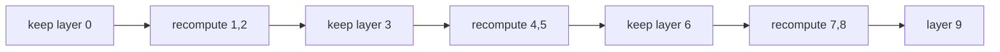

# Diagram — Activation Checkpointing — Remember Less, Recompute Exactly


```mermaid
flowchart LR
    C0["keep layer 0"] --> R1["recompute 1,2"] --> C3["keep layer 3"]
    C3 --> R2["recompute 4,5"] --> C6["keep layer 6"]
    C6 --> R3["recompute 7,8"] --> L9["layer 9"]
```

```text
stored:      0       3       6
recomputed:    1 2     4 5     7 8
```
