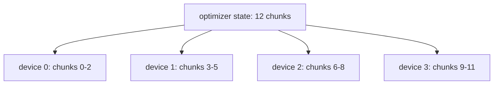

# Diagram — ZeRO — Stop Replicating the Same Training State


```mermaid
flowchart TB
    STATE["optimizer state: 12 chunks"] --> D0["device 0: chunks 0-2"]
    STATE --> D1["device 1: chunks 3-5"]
    STATE --> D2["device 2: chunks 6-8"]
    STATE --> D3["device 3: chunks 9-11"]
```

```text
replication: 12 + 12 + 12 + 12
sharding:     3 +  3 +  3 +  3
```
