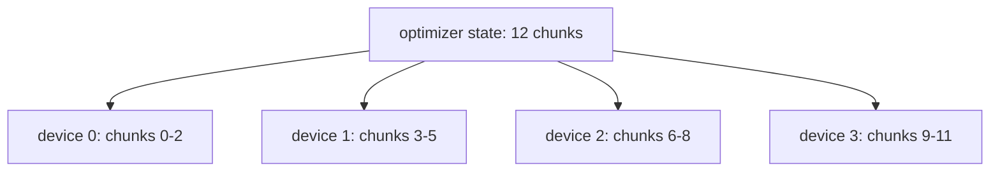

# Diagram — ZeRO — Stop Replicating the Same Training State



```text
replication: 12 + 12 + 12 + 12
sharding:     3 +  3 +  3 +  3
```

<!-- memory-film-v1:start -->
## Five-frame memory film

```text
QUESTION       What fails if we add devices and replicate the full training state on each one?
     ↓
OBJECT         the zero map mounted on the brass reference machine
     ↓
VISIBLE BREAK  The map follows the tempting path—add devices and replicate the full training state on each one. Then the evidence answers: compute capacity grows while per-device model-state memory remains almost unchanged, so the same memory wall returns.
     ↓
TRANSFORMATION The enginewright changes one moving part. The map can now partition optimizer states, gradients, and eventually parameters across data-parallel workers, gathering pieces only when computation needs them.
     ↓
MEMORY SEAL    ZeRO keeps the missing power: partition optimizer states, gradients, and eventually parameters across data-parallel workers, gathering pieces only when computation needs them.
```
<!-- memory-film-v1:end -->
