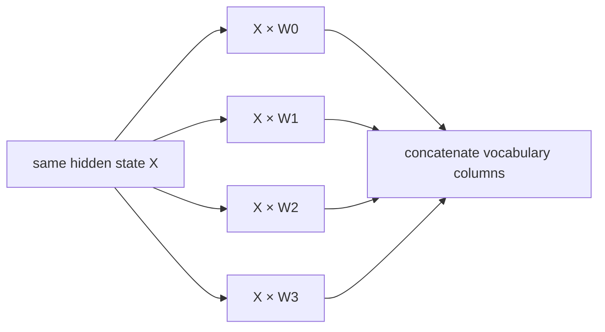

# Diagram — Tensor Parallelism — Split One Matrix That No Device Can Hold


```mermaid
flowchart LR
    X["same hidden state X"] --> D0["X × W0"]
    X --> D1["X × W1"]
    X --> D2["X × W2"]
    X --> D3["X × W3"]
    D0 --> CAT["concatenate vocabulary columns"]
    D1 --> CAT
    D2 --> CAT
    D3 --> CAT
```

```text
[quarter logits][quarter logits][quarter logits][quarter logits] -> full logits
```
