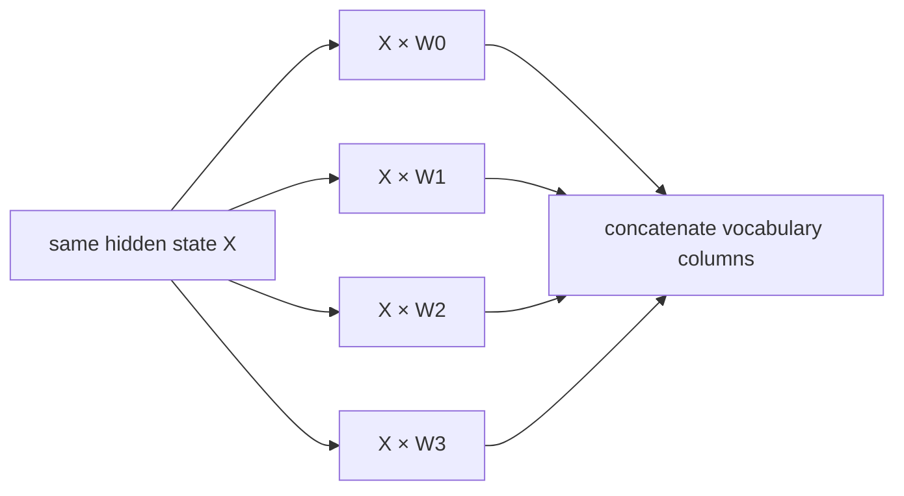

# Diagram — Tensor Parallelism — Split One Matrix That No Device Can Hold



```text
[quarter logits][quarter logits][quarter logits][quarter logits] -> full logits
```

<!-- memory-film-v1:start -->
## Five-frame memory film

```text
QUESTION       What fails if we assign whole layers to different devices and pass every activation through them sequentially?
     ↓
OBJECT         the tensor parallelism scale mounted on the brass reference machine
     ↓
VISIBLE BREAK  The scale follows the tempting path—assign whole layers to different devices and pass every activation through them sequentially. Then the evidence answers: one oversized layer still cannot fit, and devices responsible for later layers wait while earlier ones work.
     ↓
TRANSFORMATION The enginewright changes one moving part. The scale can now split a matrix across its columns or rows, compute partial results concurrently, and communicate only the pieces needed to assemble the exact layer output.
     ↓
MEMORY SEAL    Tensor Parallelism keeps the missing power: split a matrix across its columns or rows, compute partial results concurrently, and communicate only the pieces needed to assemble the exact layer output.
```
<!-- memory-film-v1:end -->
