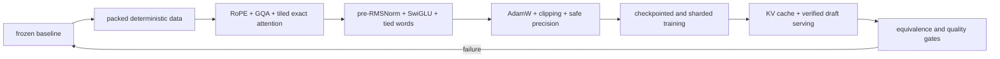

# Diagram — A Modern Tiny Language Model — Assemble the Measured Engine


```mermaid
flowchart LR
    B["frozen baseline"] --> D["packed deterministic data"] --> A["RoPE + GQA + tiled exact attention"]
    A --> K["pre-RMSNorm + SwiGLU + tied words"] --> O["AdamW + clipping + safe precision"]
    O --> S["checkpointed and sharded training"] --> I["KV cache + verified draft serving"]
    I --> E["equivalence and quality gates"]
    E -->|"failure"| B
```

```text
no speedup enters the engine without a reference result beside it
```
