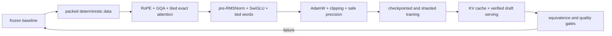

# Diagram — A Modern Tiny Language Model — Assemble the Measured Engine



```text
no speedup enters the engine without a reference result beside it
```

<!-- memory-film-v1:start -->
## Five-frame memory film

```text
QUESTION       What fails if we enable every technique at once and celebrate if the program runs?
     ↓
OBJECT         the modern tiny language model prism mounted on the brass reference machine
     ↓
VISIBLE BREAK  The prism follows the tempting path—enable every technique at once and celebrate if the program runs. Then the evidence answers: when quality or speed changes, no one knows which mechanism caused it; masks, precision, sharding, and caches can disagree at their boundaries.
     ↓
TRANSFORMATION The enginewright changes one moving part. The prism can now assemble the engine in dependency order, preserve a reference path, and test numerical or distributional equivalence at every boundary before accepting measured gains.
     ↓
MEMORY SEAL    A Modern Tiny Language Model keeps the missing power: assemble the engine in dependency order, preserve a reference path, and test numerical or distributional equivalence at every boundary before accepting measured gains.
```
<!-- memory-film-v1:end -->
