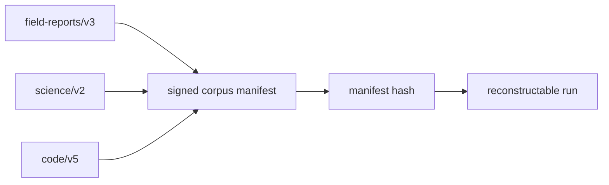

# Diagram — A Corpus Manifest — Know What Entered the Run



```text
source + version + count + hash + usage basis -> one frozen evidence ledger
```

<!-- memory-film-v1:start -->
## Five-frame memory film

```text
QUESTION       What fails if we copy every available text file into one large folder and begin tokenizing?
     ↓
OBJECT         the corpus manifest seal mounted on the chain-of-custody ledger
     ↓
VISIBLE BREAK  The seal follows the tempting path—copy every available text file into one large folder and begin tokenizing. Then the evidence answers: a file is replaced upstream, another is silently skipped, and a third appears twice under different paths. The same training command now describes a different body of evidence.
     ↓
TRANSFORMATION The archivist-engineer changes one moving part. The seal can now create an immutable manifest that records each source, version, content hash, license or usage basis, processing stage, and document count before any training shard exists.
     ↓
MEMORY SEAL    A Corpus Manifest keeps the missing power: create an immutable manifest that records each source, version, content hash, license or usage basis, processing stage, and document count before any training shard exists.
```
<!-- memory-film-v1:end -->
