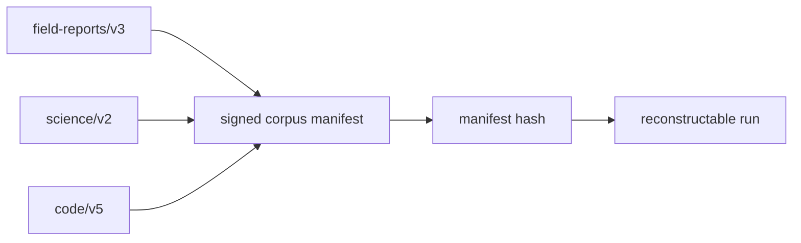

# Diagram — A Corpus Manifest — Know What Entered the Run


```mermaid
flowchart LR
  S1["field-reports/v3"] --> M["signed corpus manifest"]
  S2["science/v2"] --> M
  S3["code/v5"] --> M
  M --> H["manifest hash"] --> R["reconstructable run"]
```

```text
source + version + count + hash + usage basis -> one frozen evidence ledger
```
