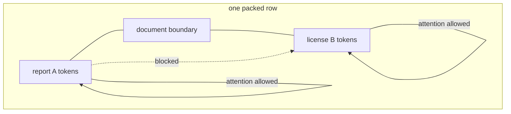

# Diagram — Document Boundaries — Keep One Story from Leaking into Another


```mermaid
flowchart TB
  subgraph Row["one packed row"]
    A["report A tokens"] --- B["document boundary"] --- C["license B tokens"]
  end
  A -->|"attention allowed"| A
  C -->|"attention allowed"| C
  A -. "blocked" .-> C
```

```text
A A A | B B
1 1 1 | 0 0   <- what an A token may read
```
