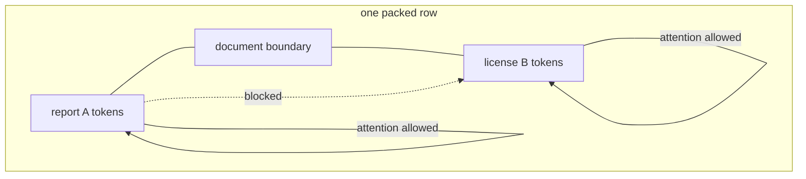

# Diagram — Document Boundaries — Keep One Story from Leaking into Another



```text
A A A | B B
1 1 1 | 0 0   <- what an A token may read
```

<!-- memory-film-v1:start -->
## Five-frame memory film

```text
QUESTION       What fails if we join every token sequence end to end and cut fixed-length training windows wherever the counter reaches the context width?
     ↓
OBJECT         the document boundaries lens mounted on the chain-of-custody ledger
     ↓
VISIBLE BREAK  The lens follows the tempting path—join every token sequence end to end and cut fixed-length training windows wherever the counter reaches the context width. Then the evidence answers: a ranger report ending with “tiger tracks near” is trained to predict the first word of an unrelated software license. The model receives a relationship that never existed in either document.
     ↓
TRANSFORMATION The archivist-engineer changes one moving part. The lens can now mark document ends, reset position where the design requires it, and block attention or loss across boundaries unless cross-document packing is explicitly intended.
     ↓
MEMORY SEAL    Document Boundaries keeps the missing power: mark document ends, reset position where the design requires it, and block attention or loss across boundaries unless cross-document packing is explicitly intended.
```
<!-- memory-film-v1:end -->
