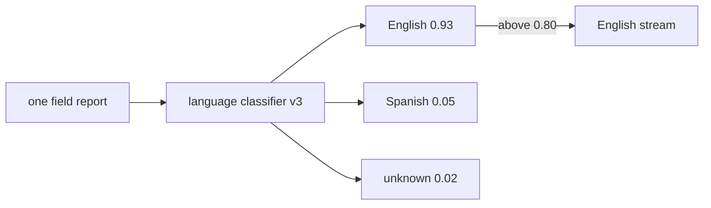

# Diagram — Language Identification — Do Not Confuse Familiar Script with Familiar Language



```text
winner without confidence -> forced label
winner plus threshold      -> label or unknown
```

<!-- memory-film-v1:start -->
## Five-frame memory film

```text
QUESTION       What fails if we keep documents containing mostly familiar Latin characters and discard the rest?
     ↓
OBJECT         the language identification key mounted on the chain-of-custody ledger
     ↓
VISIBLE BREAK  The key follows the tempting path—keep documents containing mostly familiar Latin characters and discard the rest. Then the evidence answers: spanish and Vietnamese are mistaken for English, transliterated languages disappear, and English code or identifier lists pass despite containing little natural language.
     ↓
TRANSFORMATION The archivist-engineer changes one moving part. The key can now use a calibrated language classifier, retain its confidence and model version, and route uncertain documents to an explicit unknown bucket rather than forcing a label.
     ↓
MEMORY SEAL    Language Identification keeps the missing power: use a calibrated language classifier, retain its confidence and model version, and route uncertain documents to an explicit unknown bucket rather than forcing a label.
```
<!-- memory-film-v1:end -->
