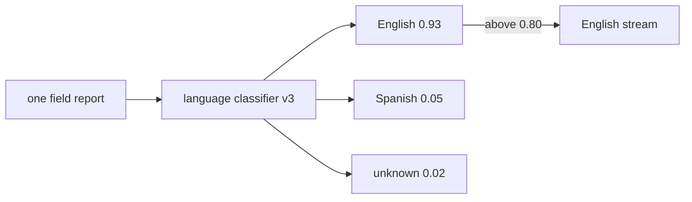

# Diagram — Language Identification — Do Not Confuse Familiar Script with Familiar Language


```mermaid
flowchart LR
  D["one field report"] --> C["language classifier v3"]
  C --> E["English 0.93"]
  C --> S["Spanish 0.05"]
  C --> U["unknown 0.02"]
  E -->|"above 0.80"| KEEP["English stream"]
```

```text
winner without confidence -> forced label
winner plus threshold      -> label or unknown
```
