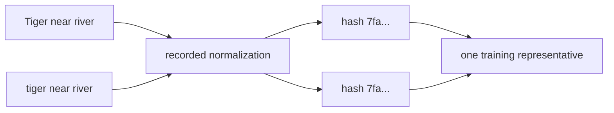

# Diagram — Exact Deduplication — Stop Paying Twice for the Same Document



```text
three locations -> one fingerprint -> one vote, three provenance records
```

<!-- memory-film-v1:start -->
## Five-frame memory film

```text
QUESTION       What fails if we leave duplicates in place because more training examples should always help?
     ↓
OBJECT         the exact deduplication lantern mounted on the chain-of-custody ledger
     ↓
VISIBLE BREAK  The lantern follows the tempting path—leave duplicates in place because more training examples should always help. Then the evidence answers: one press release copied to a thousand sites receives a thousand votes, while a rare field observation receives one. Compute is spent memorizing repetition rather than encountering new evidence.
     ↓
TRANSFORMATION The archivist-engineer changes one moving part. The lantern can now normalize only irrelevant formatting, hash the resulting document, and keep one accountable representative for each identical hash while preserving duplicate counts in the ledger.
     ↓
MEMORY SEAL    Exact Deduplication keeps the missing power: normalize only irrelevant formatting, hash the resulting document, and keep one accountable representative for each identical hash while preserving duplicate counts in the ledger.
```
<!-- memory-film-v1:end -->
