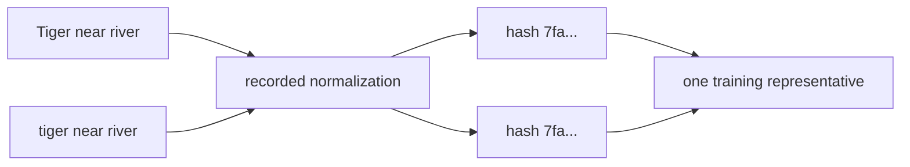

# Diagram — Exact Deduplication — Stop Paying Twice for the Same Document


```mermaid
flowchart LR
  A["Tiger near river\n"] --> N["recorded normalization"] --> H1["hash 7fa..."]
  B[" tiger  near river "] --> N --> H2["hash 7fa..."]
  H1 --> ONE["one training representative"]
  H2 --> ONE
```

```text
three locations -> one fingerprint -> one vote, three provenance records
```
