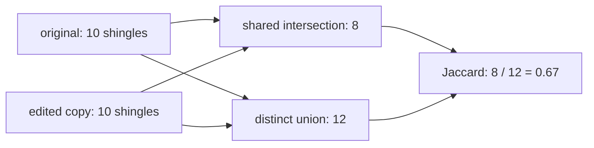

# Diagram — Near Deduplication — When a Copy Changes a Few Words



```text
shared 8 / distinct total 12 = 0.67 near-duplicate similarity
```

<!-- memory-film-v1:start -->
## Five-frame memory film

```text
QUESTION       When a Copy Changes a Few Words?
     ↓
OBJECT         the near deduplication compass mounted on the chain-of-custody ledger
     ↓
VISIBLE BREAK  The compass follows the tempting path—lowercase both documents and demand that every remaining word match. Then the evidence answers: one inserted advertisement defeats the rule, while independently written short notices can match by accident. Exact sequence equality is too brittle for disguised copies.
     ↓
TRANSFORMATION The archivist-engineer changes one moving part. The compass can now represent each document by overlapping shingles, compare the shared fraction with Jaccard similarity, and use MinHash-style candidate retrieval before exact verification at scale.
     ↓
MEMORY SEAL    Near Deduplication keeps the missing power: represent each document by overlapping shingles, compare the shared fraction with Jaccard similarity, and use MinHash-style candidate retrieval before exact verification at scale.
```
<!-- memory-film-v1:end -->
