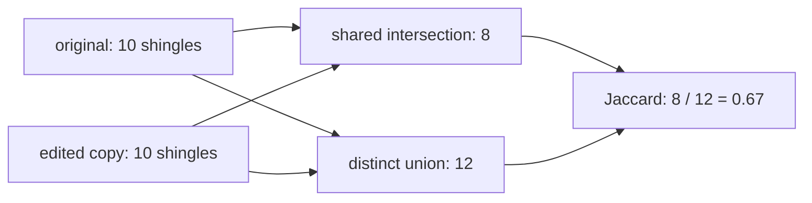

# Diagram — Near Deduplication — When a Copy Changes a Few Words


```mermaid
flowchart LR
  A["original: 10 shingles"] --> I["shared intersection: 8"]
  B["edited copy: 10 shingles"] --> I
  A --> U["distinct union: 12"]
  B --> U
  I --> J["Jaccard: 8 / 12 = 0.67"]
  U --> J
```

```text
shared 8 / distinct total 12 = 0.67 near-duplicate similarity
```
