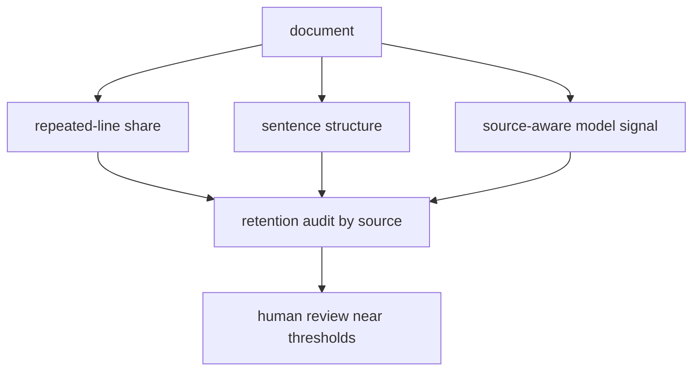

# Diagram — Quality Filtering — Remove Noise Without Defining Humanity Away



```text
filter quality must be measured twice: what it removes and whom it removes
```

<!-- memory-film-v1:start -->
## Five-frame memory film

```text
QUESTION       What fails if we keep only documents that resemble one prestigious encyclopedia?
     ↓
OBJECT         the quality filtering bridge mounted on the chain-of-custody ledger
     ↓
VISIBLE BREAK  The bridge follows the tempting path—keep only documents that resemble one prestigious encyclopedia. Then the evidence answers: the filter removes spam, but it also suppresses informal dialect, local knowledge, code, dialogue, and communities whose writing differs from the chosen reference.
     ↓
TRANSFORMATION The archivist-engineer changes one moving part. The bridge can now combine transparent structural signals with small controlled model-based tests, inspect what each threshold removes, and publish source-by-source retention counts before accepting a filter.
     ↓
MEMORY SEAL    Quality Filtering keeps the missing power: combine transparent structural signals with small controlled model-based tests, inspect what each threshold removes, and publish source-by-source retention counts before accepting a filter.
```
<!-- memory-film-v1:end -->
