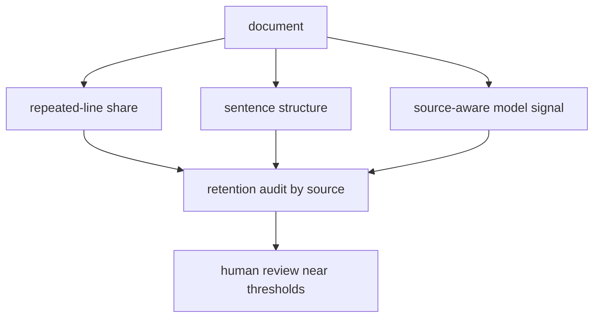

# Diagram — Quality Filtering — Remove Noise Without Defining Humanity Away


```mermaid
flowchart TD
  D["document"] --> S1["repeated-line share"]
  D --> S2["sentence structure"]
  D --> S3["source-aware model signal"]
  S1 --> A["retention audit by source"]
  S2 --> A
  S3 --> A
  A --> H["human review near thresholds"]
```

```text
filter quality must be measured twice: what it removes and whom it removes
```
