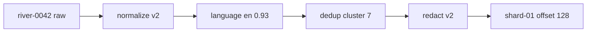

# Diagram — Data Provenance — Keep the Path Back to Every Source



```text
final token -> shard offset -> decision trail -> original source
```

<!-- memory-film-v1:start -->
## Five-frame memory film

```text
QUESTION       What fails if we save only the final cleaned text because intermediate metadata costs storage?
     ↓
OBJECT         the data provenance thread mounted on the chain-of-custody ledger
     ↓
VISIBLE BREAK  The thread follows the tempting path—save only the final cleaned text because intermediate metadata costs storage. Then the evidence answers: a rights request, filtering bug, or benchmark contamination report arrives, but the final shard cannot be mapped back to the source record or processing rule that produced it.
     ↓
TRANSFORMATION The archivist-engineer changes one moving part. The thread can now assign stable document identities and record a lineage edge for every fetch, normalization, filter, redaction, deduplication group, and output shard.
     ↓
MEMORY SEAL    Data Provenance keeps the missing power: assign stable document identities and record a lineage edge for every fetch, normalization, filter, redaction, deduplication group, and output shard.
```
<!-- memory-film-v1:end -->
