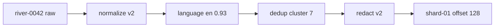

# Diagram — Data Provenance — Keep the Path Back to Every Source


```mermaid
flowchart LR
  RAW["river-0042 raw"] --> N["normalize v2"] --> L["language en 0.93"] --> D["dedup cluster 7"] --> P["redact v2"] --> S["shard-01 offset 128"]
```

```text
final token -> shard offset -> decision trail -> original source
```
