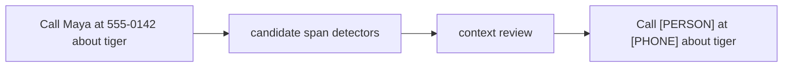

# Diagram — PII Redaction — Do Not Turn Accidental Secrets into Lessons


```mermaid
flowchart LR
  O["Call Maya at 555-0142 about tiger"] --> DET["candidate span detectors"]
  DET --> CTX["context review"] --> R["Call [PERSON] at [PHONE] about tiger"]
```

```text
keep the grammatical lesson; remove the direct identifier; log the rule
```
