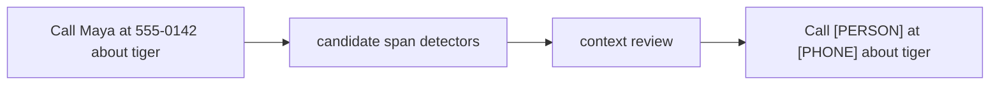

# Diagram — PII Redaction — Do Not Turn Accidental Secrets into Lessons



```text
keep the grammatical lesson; remove the direct identifier; log the rule
```

<!-- memory-film-v1:start -->
## Five-frame memory film

```text
QUESTION       What fails if we remove any entire document containing a sequence that resembles personal information?
     ↓
OBJECT         the pii redaction mirror mounted on the chain-of-custody ledger
     ↓
VISIBLE BREAK  The mirror follows the tempting path—remove any entire document containing a sequence that resembles personal information. Then the evidence answers: one phone number erases a long public safety guide, while obfuscated addresses and context-dependent identifiers still pass. The rule destroys useful evidence without reliably removing the risky span.
     ↓
TRANSFORMATION The archivist-engineer changes one moving part. The mirror can now detect candidate spans with several methods, classify them in context, replace confirmed sensitive spans with typed placeholders, and preserve only a restricted audit record of the decision.
     ↓
MEMORY SEAL    PII Redaction keeps the missing power: detect candidate spans with several methods, classify them in context, replace confirmed sensitive spans with typed placeholders, and preserve only a restricted audit record of the decision.
```
<!-- memory-film-v1:end -->
