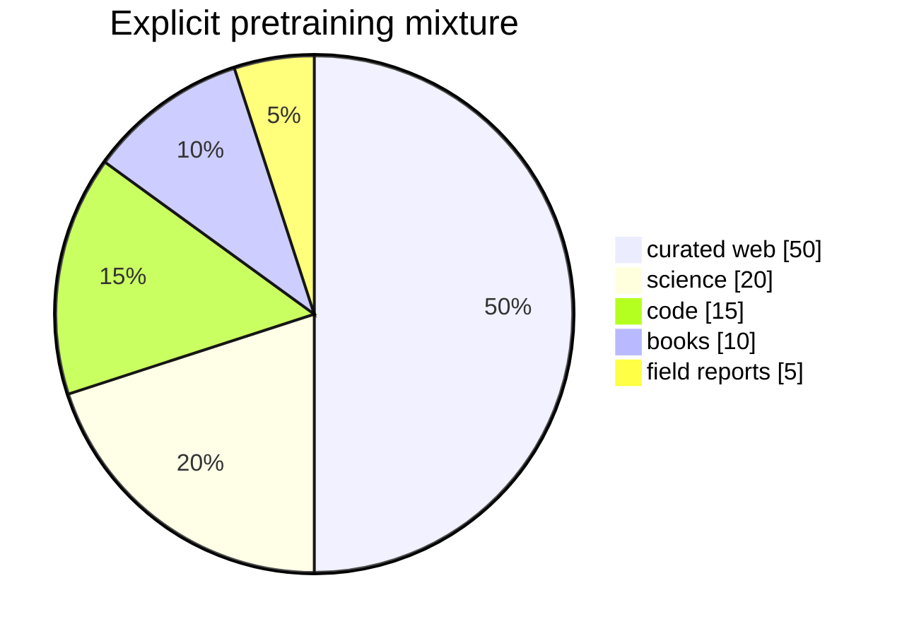

# Diagram — Data Mixtures — Decide Which Worlds Receive a Voice



```text
raw corpus size does not get to choose the curriculum silently
```

<!-- memory-film-v1:start -->
## Five-frame memory film

```text
QUESTION       What fails if we concatenate every accepted source and let its raw token count determine how often it appears?
     ↓
OBJECT         the data mixtures bell mounted on the chain-of-custody ledger
     ↓
VISIBLE BREAK  The bell follows the tempting path—concatenate every accepted source and let its raw token count determine how often it appears. Then the evidence answers: the largest crawl silently becomes the curriculum. A source ten thousand times smaller may almost never reach a batch even when it carries relationships absent from the web.
     ↓
TRANSFORMATION The archivist-engineer changes one moving part. The bell can now choose and publish a probability weight for each domain, treating the mixture as an explicit modeling decision that must be tested on per-domain validation streams.
     ↓
MEMORY SEAL    Data Mixtures keeps the missing power: choose and publish a probability weight for each domain, treating the mixture as an explicit modeling decision that must be tested on per-domain validation streams.
```
<!-- memory-film-v1:end -->
