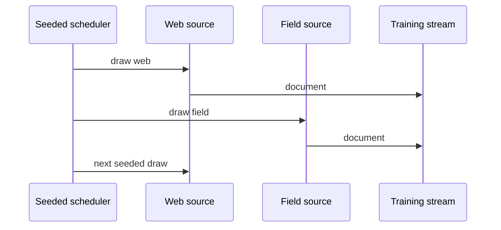

# Diagram — Mixture Sampling — Turn Planned Shares into a Reproducible Stream



```text
planned share -> seeded choices -> realized counts -> resumable cursor
```

<!-- memory-film-v1:start -->
## Five-frame memory film

```text
QUESTION       What fails if we round each domain's desired share independently and concatenate the resulting blocks?
     ↓
OBJECT         the mixture sampling vessel mounted on the chain-of-custody ledger
     ↓
VISIBLE BREAK  The vessel follows the tempting path—round each domain's desired share independently and concatenate the resulting blocks. Then the evidence answers: independent rounding can exceed the budget, and long blocks make training order depend on domain. A small domain may vanish when its expected count rounds to zero.
     ↓
TRANSFORMATION The archivist-engineer changes one moving part. The vessel can now use a seeded categorical schedule, track realized counts against expected counts, and define exhaustion or replacement rules for every source.
     ↓
MEMORY SEAL    Mixture Sampling keeps the missing power: use a seeded categorical schedule, track realized counts against expected counts, and define exhaustion or replacement rules for every source.
```
<!-- memory-film-v1:end -->
