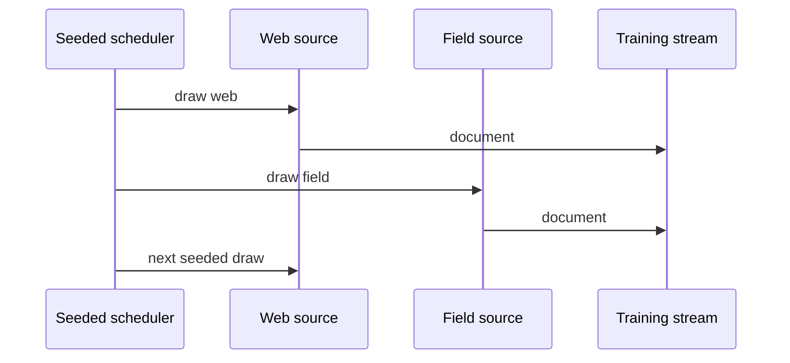

# Diagram — Mixture Sampling — Turn Planned Shares into a Reproducible Stream


```mermaid
sequenceDiagram
  participant RNG as Seeded scheduler
  participant W as Web source
  participant F as Field source
  participant T as Training stream
  RNG->>W: draw web
  W->>T: document
  RNG->>F: draw field
  F->>T: document
  RNG->>W: next seeded draw
```

```text
planned share -> seeded choices -> realized counts -> resumable cursor
```
