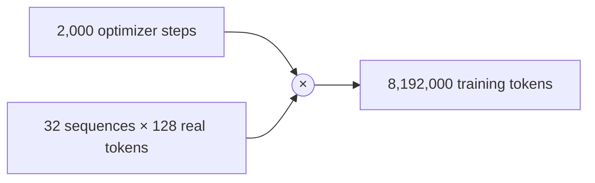

# Diagram — The Token Budget — Convert a Training Plan into a Count of Lessons


```mermaid
flowchart LR
  S["2,000 optimizer steps"] --> X(("×"))
  B["32 sequences × 128 real tokens"] --> X
  X --> T["8,192,000 training tokens"]
```

```text
calendar time varies; the promised number of lessons does not
```
