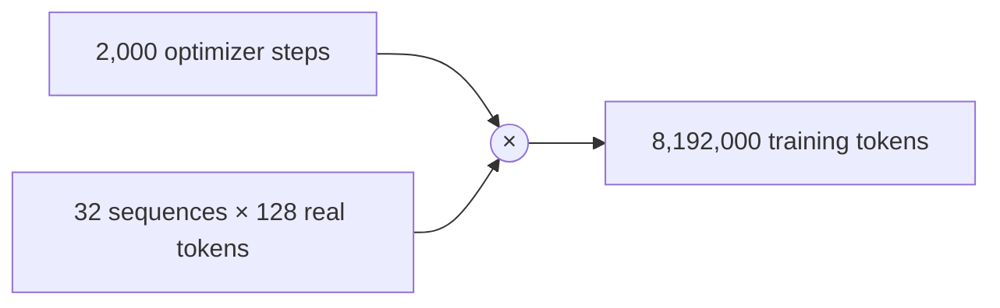

# Diagram — The Token Budget — Convert a Training Plan into a Count of Lessons



```text
calendar time varies; the promised number of lessons does not
```

<!-- memory-film-v1:start -->
## Five-frame memory film

```text
QUESTION       What fails if we stop when the wall clock reaches an affordable date?
     ↓
OBJECT         the token budget gate mounted on the chain-of-custody ledger
     ↓
VISIBLE BREAK  The gate follows the tempting path—stop when the wall clock reaches an affordable date. Then the evidence answers: faster hardware sees more tokens, interruptions see fewer, and two runs with the same calendar budget teach different amounts of evidence.
     ↓
TRANSFORMATION The archivist-engineer changes one moving part. The gate can now define the run by optimization steps and real loss-bearing tokens per global batch, then derive the total token budget before reserving compute.
     ↓
MEMORY SEAL    The Token Budget keeps the missing power: define the run by optimization steps and real loss-bearing tokens per global batch, then derive the total token budget before reserving compute.
```
<!-- memory-film-v1:end -->
