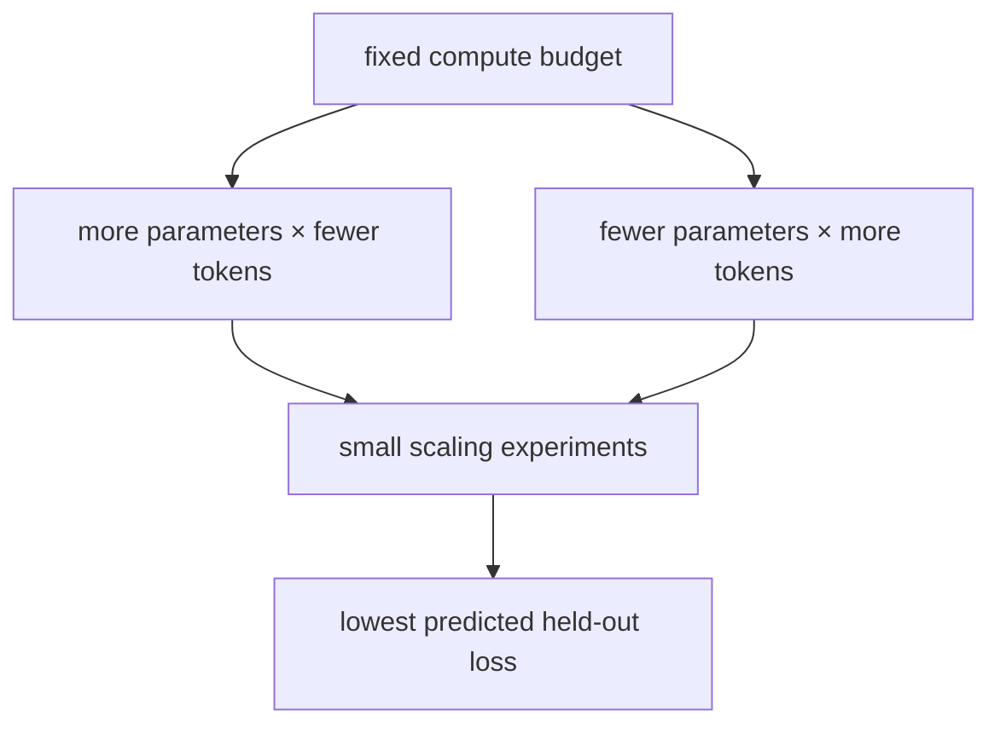

# Diagram — Compute-Optimal Allocation — Buy a Larger Memory or More Experience?



```text
compute buys parameter-token interactions, not size alone
```

<!-- memory-film-v1:start -->
## Five-frame memory film

```text
QUESTION       What fails if we spend nearly the entire budget on parameter count because a larger model can store more patterns?
     ↓
OBJECT         the compute-optimal allocation wheel mounted on the chain-of-custody ledger
     ↓
VISIBLE BREAK  The wheel follows the tempting path—spend nearly the entire budget on parameter count because a larger model can store more patterns. Then the evidence answers: the large model is stopped after too little experience and remains undertrained, while much of its expensive capacity never receives enough varied evidence.
     ↓
TRANSFORMATION The archivist-engineer changes one moving part. The wheel can now estimate candidate parameter-and-token pairs under the same compute budget, run smaller scaling experiments, and choose the pair predicted to minimize held-out loss rather than maximizing either axis alone.
     ↓
MEMORY SEAL    Compute-Optimal Allocation keeps the missing power: estimate candidate parameter-and-token pairs under the same compute budget, run smaller scaling experiments, and choose the pair predicted to minimize held-out loss rather than maximizing either axis alone.
```
<!-- memory-film-v1:end -->
