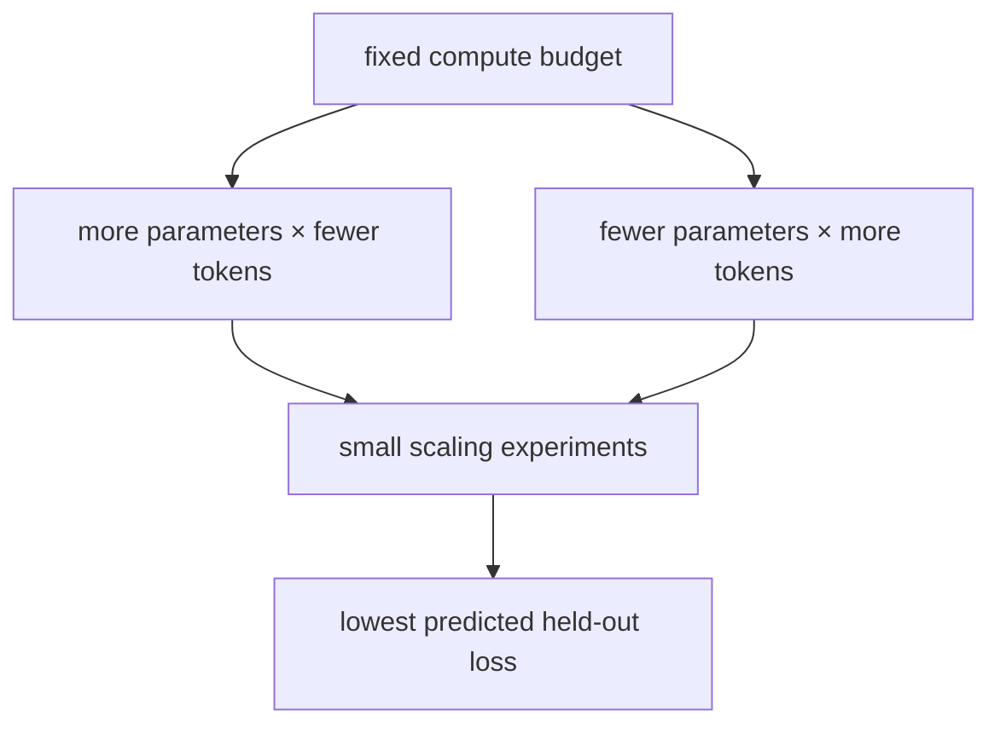

# Diagram — Compute-Optimal Allocation — Buy a Larger Memory or More Experience?


```mermaid
flowchart TB
  C["fixed compute budget"] --> A["more parameters × fewer tokens"]
  C --> B["fewer parameters × more tokens"]
  A --> V["small scaling experiments"]
  B --> V
  V --> CHOICE["lowest predicted held-out loss"]
```

```text
compute buys parameter-token interactions, not size alone
```
