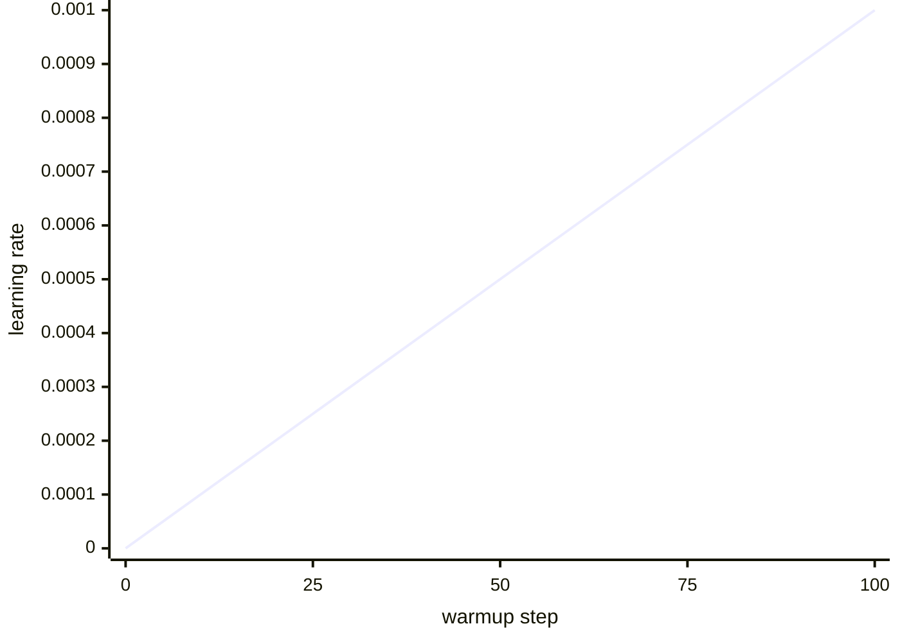

# Diagram — Learning-Rate Warmup — Let Adam Learn the Terrain Before Running


```mermaid
xychart-beta
  x-axis "warmup step" [0,25,50,75,100]
  y-axis "learning rate" 0 --> 0.001
  line [0,0.00025,0.0005,0.00075,0.001]
```

```text
empty Adam memory + peak rate -> early shock
gradual rate                  -> time to learn scale
```
