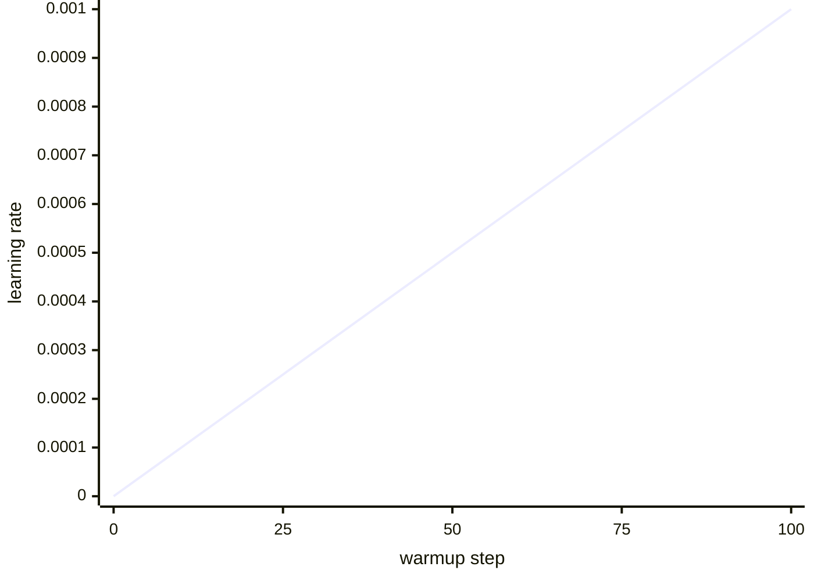

# Diagram — Learning-Rate Warmup — Let Adam Learn the Terrain Before Running



```text
empty Adam memory + peak rate -> early shock
gradual rate                  -> time to learn scale
```

<!-- memory-film-v1:start -->
## Five-frame memory film

```text
QUESTION       What fails if we begin immediately at the peak learning rate chosen for the stable middle of training?
     ↓
OBJECT         the learning-rate warmup map mounted on the chain-of-custody ledger
     ↓
VISIBLE BREAK  The map follows the tempting path—begin immediately at the peak learning rate chosen for the stable middle of training. Then the evidence answers: the first noisy batches can make large updates before the optimizer's scale estimates become trustworthy, producing a loss spike that the later stable rate would not have caused.
     ↓
TRANSFORMATION The archivist-engineer changes one moving part. The map can now increase the learning rate gradually from zero or a small value during a recorded warmup interval, then hand control to the main schedule.
     ↓
MEMORY SEAL    Learning-Rate Warmup keeps the missing power: increase the learning rate gradually from zero or a small value during a recorded warmup interval, then hand control to the main schedule.
```
<!-- memory-film-v1:end -->
