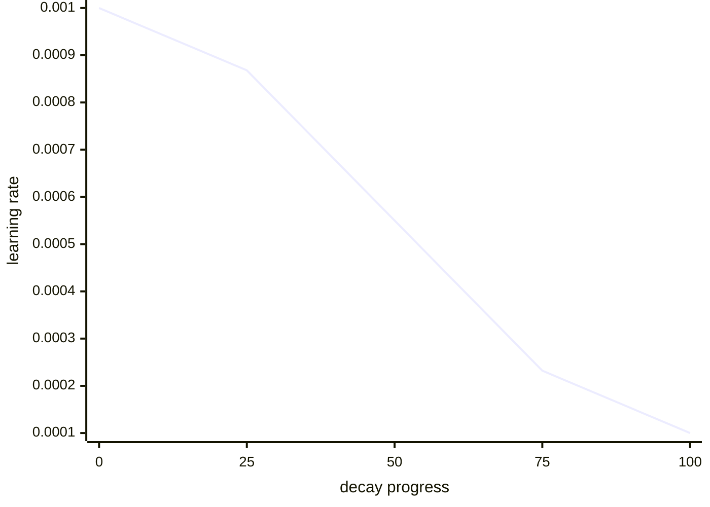

# Diagram — Cosine Decay — Make Late Corrections Smaller Without a Cliff


```mermaid
xychart-beta
  x-axis "decay progress" [0,25,50,75,100]
  y-axis "learning rate" 0.0001 --> 0.001
  line [0.001,0.000868,0.00055,0.000232,0.0001]
```

```text
broad early movement -> careful late correction, without a sudden cliff
```
