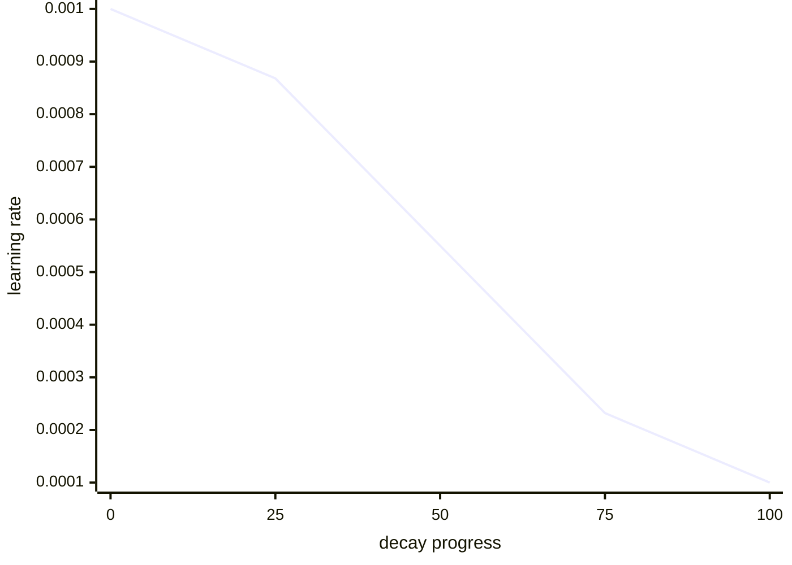

# Diagram — Cosine Decay — Make Late Corrections Smaller Without a Cliff



```text
broad early movement -> careful late correction, without a sudden cliff
```

<!-- memory-film-v1:start -->
## Five-frame memory film

```text
QUESTION       What fails if we drop the rate abruptly near the end of training?
     ↓
OBJECT         the cosine decay scale mounted on the chain-of-custody ledger
     ↓
VISIBLE BREAK  The scale follows the tempting path—drop the rate abruptly near the end of training. Then the evidence answers: a sudden cliff changes update scale in one step and makes the chosen drop date an arbitrary discontinuity; dropping too early freezes useful learning.
     ↓
TRANSFORMATION The archivist-engineer changes one moving part. The scale can now decay smoothly from the peak toward a chosen minimum over the remaining horizon, while recording the schedule as part of the resumable state.
     ↓
MEMORY SEAL    Cosine Decay keeps the missing power: decay smoothly from the peak toward a chosen minimum over the remaining horizon, while recording the schedule as part of the resumable state.
```
<!-- memory-film-v1:end -->
