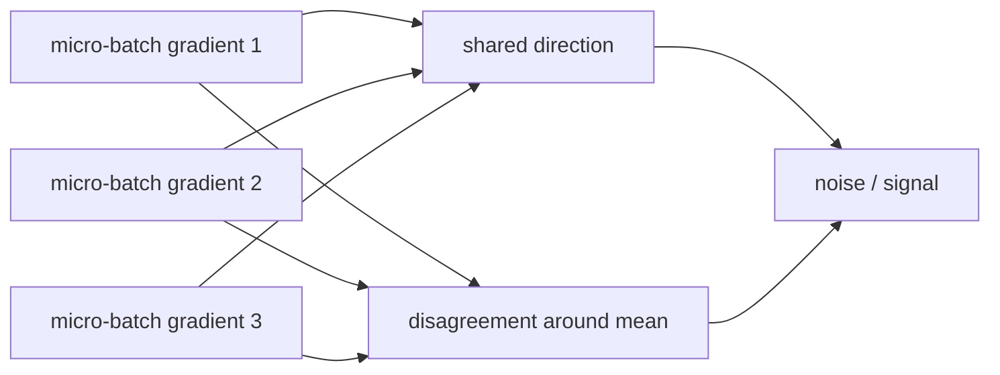

# Diagram — Gradient Noise Scale — When More Examples Stop Buying More Direction


```mermaid
flowchart LR
  G1["micro-batch gradient 1"] --> M["shared direction"]
  G2["micro-batch gradient 2"] --> M
  G3["micro-batch gradient 3"] --> M
  G1 --> N["disagreement around mean"]
  G2 --> N
  G3 --> N
  M --> R["noise / signal"]
  N --> R
```

```text
more witnesses help while disagreement is large relative to shared advice
```
