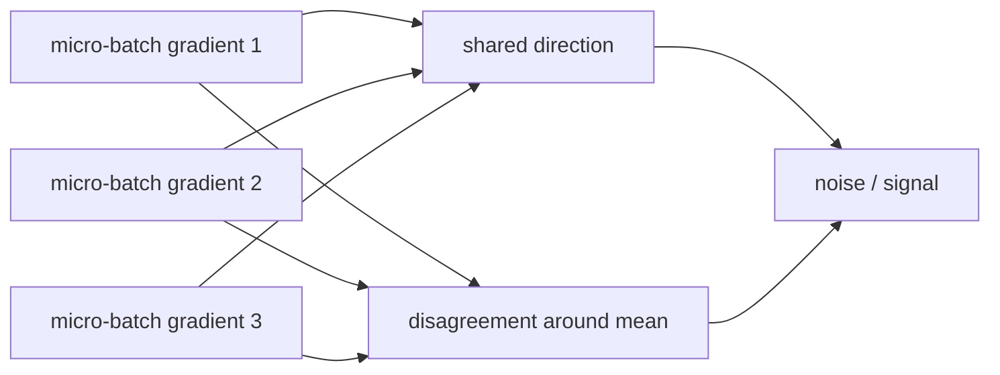

# Diagram — Gradient Noise Scale — When More Examples Stop Buying More Direction



```text
more witnesses help while disagreement is large relative to shared advice
```

<!-- memory-film-v1:start -->
## Five-frame memory film

```text
QUESTION       When More Examples Stop Buying More Direction?
     ↓
OBJECT         the gradient noise scale gear mounted on the chain-of-custody ledger
     ↓
VISIBLE BREAK  The gear follows the tempting path—make the global batch as large as the cluster permits. Then the evidence answers: early doubling reduces disagreement and improves the direction, but beyond a workload-dependent point the averaged gradient barely changes while each update consumes twice as many tokens.
     ↓
TRANSFORMATION The archivist-engineer changes one moving part. The gear can now measure disagreement among micro-batch gradients relative to the strength of their shared direction, and use that noise scale as evidence for the largest useful batch rather than a hardware target.
     ↓
MEMORY SEAL    Gradient Noise Scale keeps the missing power: measure disagreement among micro-batch gradients relative to the strength of their shared direction, and use that noise scale as evidence for the largest useful batch rather than a hardware target.
```
<!-- memory-film-v1:end -->
