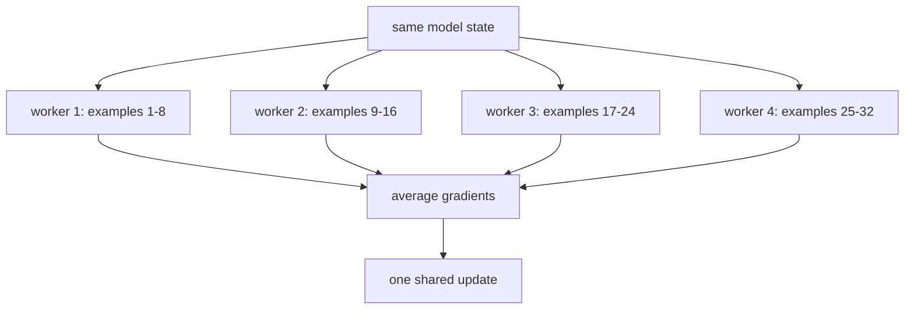

# Diagram — Data Parallelism — Let Several Workers Observe Different Evidence


```mermaid
flowchart TB
  M["same model state"] --> W1["worker 1: examples 1-8"]
  M --> W2["worker 2: examples 9-16"]
  M --> W3["worker 3: examples 17-24"]
  M --> W4["worker 4: examples 25-32"]
  W1 --> AVG["average gradients"]
  W2 --> AVG
  W3 --> AVG
  W4 --> AVG
  AVG --> U["one shared update"]
```

```text
same model, different evidence, one logically shared next state
```
