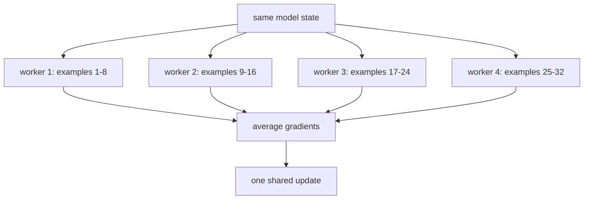

# Diagram — Data Parallelism — Let Several Workers Observe Different Evidence



```text
same model, different evidence, one logically shared next state
```

<!-- memory-film-v1:start -->
## Five-frame memory film

```text
QUESTION       What fails if we send the same mini-batch to every worker and average their gradients?
     ↓
OBJECT         the data parallelism prism mounted on the chain-of-custody ledger
     ↓
VISIBLE BREAK  The prism follows the tempting path—send the same mini-batch to every worker and average their gradients. Then the evidence answers: all workers repeat the same computation and return the same evidence, so hardware cost rises without increasing batch diversity or reducing step time meaningfully.
     ↓
TRANSFORMATION The archivist-engineer changes one moving part. The prism can now replicate the current model view, give each worker a different slice of the global batch, average their gradients, and apply one logically shared update.
     ↓
MEMORY SEAL    Data Parallelism keeps the missing power: replicate the current model view, give each worker a different slice of the global batch, average their gradients, and apply one logically shared update.
```
<!-- memory-film-v1:end -->
