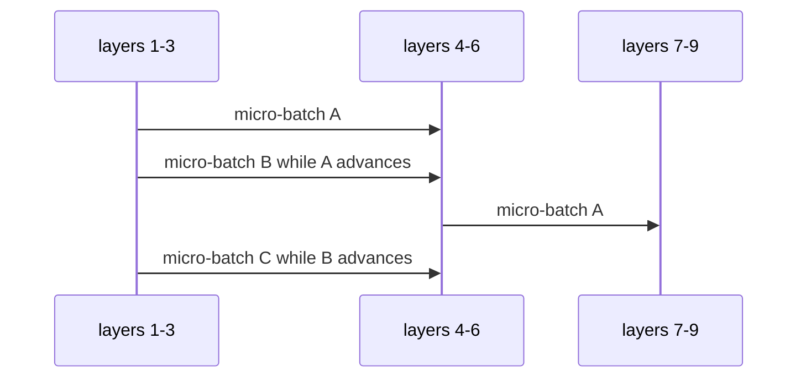

# Diagram — Pipeline Parallelism — Stop Waiting for the Whole Model to Cross One Device at a Time



```text
clock: 1 2 3 4 5
stage1 A B C . .
stage2 . A B C .
stage3 . . A B C
```

<!-- memory-film-v1:start -->
## Five-frame memory film

```text
QUESTION       What fails if we send one complete batch through stage one, then stage two, then stage three?
     ↓
OBJECT         the pipeline parallelism seal mounted on the chain-of-custody ledger
     ↓
VISIBLE BREAK  The seal follows the tempting path—send one complete batch through stage one, then stage two, then stage three. Then the evidence answers: while stage two works, stage one and stage three wait. The model fits, but most devices are idle for most of the step.
     ↓
TRANSFORMATION The archivist-engineer changes one moving part. The seal can now split the batch into micro-batches and stagger them through the layer stages so different stages work on different micro-batches concurrently.
     ↓
MEMORY SEAL    Pipeline Parallelism keeps the missing power: split the batch into micro-batches and stagger them through the layer stages so different stages work on different micro-batches concurrently.
```
<!-- memory-film-v1:end -->
