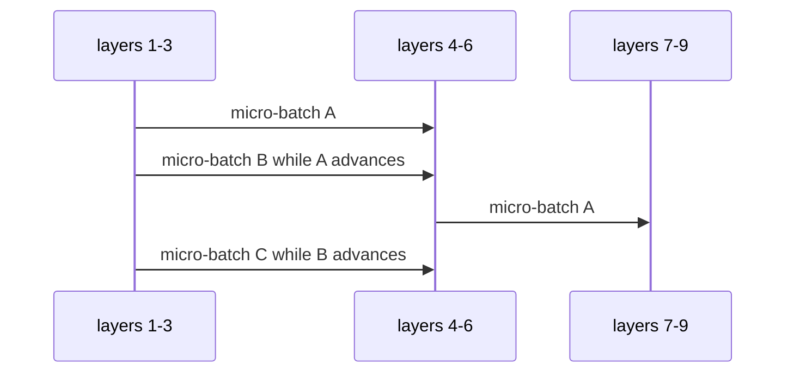

# Diagram — Pipeline Parallelism — Stop Waiting for the Whole Model to Cross One Device at a Time


```mermaid
sequenceDiagram
  participant S1 as layers 1-3
  participant S2 as layers 4-6
  participant S3 as layers 7-9
  S1->>S2: micro-batch A
  S1->>S2: micro-batch B while A advances
  S2->>S3: micro-batch A
  S1->>S2: micro-batch C while B advances
```

```text
clock: 1 2 3 4 5
stage1 A B C . .
stage2 . A B C .
stage3 . . A B C
```
