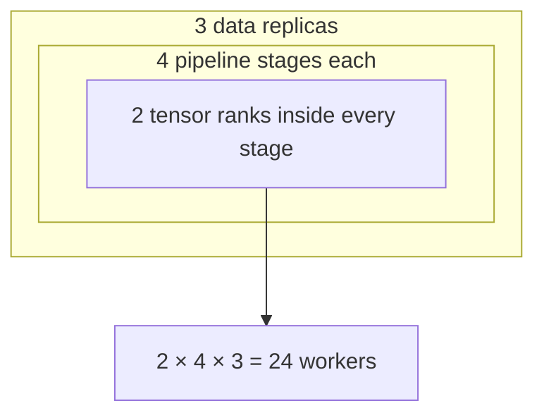

# Diagram — Three-Dimensional Parallelism — Give Each Memory Wall Its Own Axis



```text
worker identity = (tensor rank, pipeline rank, data rank)
```

<!-- memory-film-v1:start -->
## Five-frame memory film

```text
QUESTION       What fails if we increase whichever parallel technique was introduced most recently until the model fits?
     ↓
OBJECT         the three-dimensional parallelism lens mounted on the chain-of-custody ledger
     ↓
VISIBLE BREAK  The lens follows the tempting path—increase whichever parallel technique was introduced most recently until the model fits. Then the evidence answers: more pipeline stages increase bubbles, more tensor splits increase frequent communication, and more data replicas preserve full model memory. One axis cannot solve three different limits efficiently.
     ↓
TRANSFORMATION The archivist-engineer changes one moving part. The lens can now compose tensor parallelism within layers, pipeline parallelism across layer groups, and data parallelism across independent batch replicas, choosing each degree from topology and measured cost.
     ↓
MEMORY SEAL    Three-Dimensional Parallelism keeps the missing power: compose tensor parallelism within layers, pipeline parallelism across layer groups, and data parallelism across independent batch replicas, choosing each degree from topology and measured cost.
```
<!-- memory-film-v1:end -->
