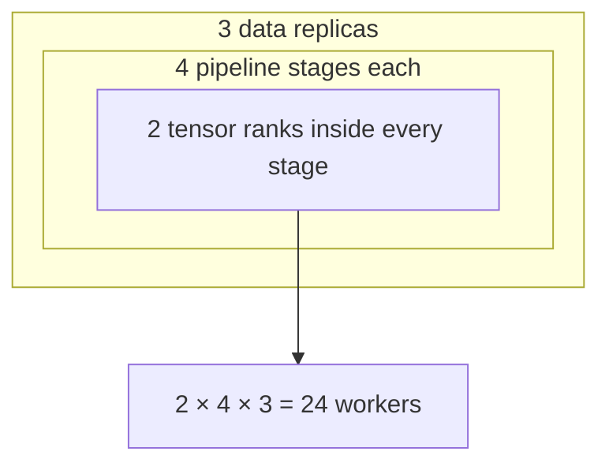

# Diagram — Three-Dimensional Parallelism — Give Each Memory Wall Its Own Axis


```mermaid
flowchart TB
  subgraph Data["3 data replicas"]
    subgraph Pipe["4 pipeline stages each"]
      T["2 tensor ranks inside every stage"]
    end
  end
  T --> TOTAL["2 × 4 × 3 = 24 workers"]
```

```text
worker identity = (tensor rank, pipeline rank, data rank)
```
