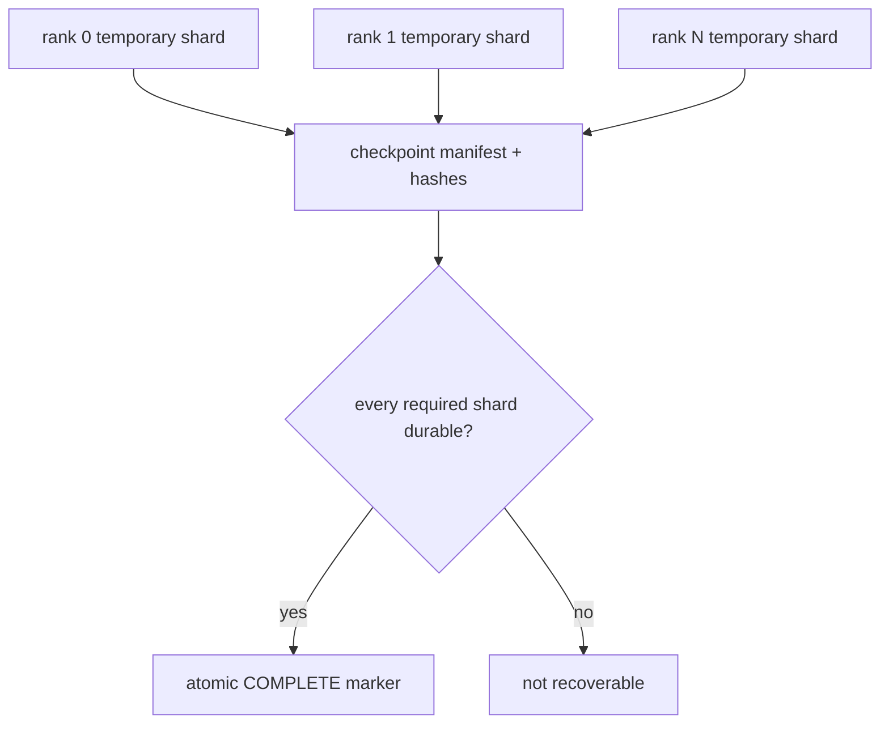

# Diagram — Sharded Checkpoints — Save One Recoverable State Without Gathering It



```text
directory exists != checkpoint complete
```

<!-- memory-film-v1:start -->
## Five-frame memory film

```text
QUESTION       What fails if we let every worker write its local tensors and call the directory a checkpoint?
     ↓
OBJECT         the sharded checkpoints key mounted on the chain-of-custody ledger
     ↓
VISIBLE BREAK  The key follows the tempting path—let every worker write its local tensors and call the directory a checkpoint. Then the evidence answers: a worker fails before writing, two shards belong to different steps, or a filename is reused. The directory exists but cannot reconstruct one globally consistent training state.
     ↓
TRANSFORMATION The archivist-engineer changes one moving part. The key can now write versioned shards to temporary locations, record hashes and ownership in a checkpoint manifest, and publish one atomic completion marker only after every required shard is durable.
     ↓
MEMORY SEAL    Sharded Checkpoints keeps the missing power: write versioned shards to temporary locations, record hashes and ownership in a checkpoint manifest, and publish one atomic completion marker only after every required shard is durable.
```
<!-- memory-film-v1:end -->
