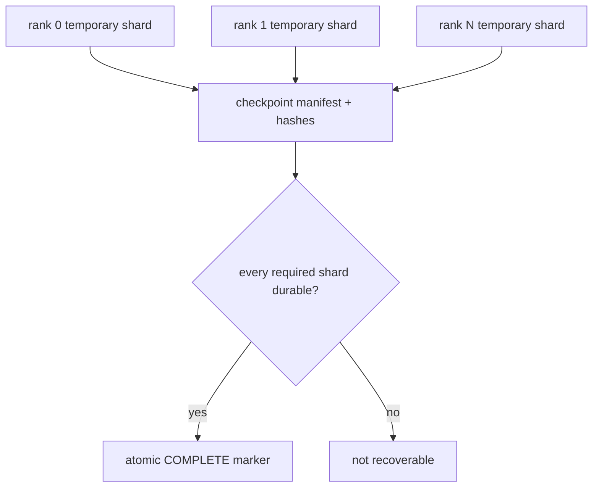

# Diagram — Sharded Checkpoints — Save One Recoverable State Without Gathering It


```mermaid
flowchart TB
  R0["rank 0 temporary shard"] --> M["checkpoint manifest + hashes"]
  R1["rank 1 temporary shard"] --> M
  RN["rank N temporary shard"] --> M
  M --> Q{"every required shard durable?"}
  Q -->|"yes"| C["atomic COMPLETE marker"]
  Q -->|"no"| X["not recoverable"]
```

```text
directory exists != checkpoint complete
```
