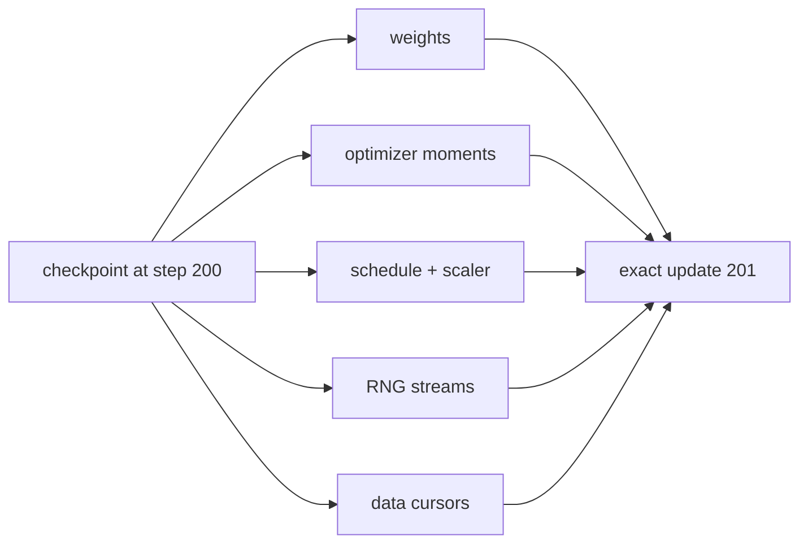

# Diagram — Deterministic Resume — Continue the Same Experiment, Not a Similar One



```text
weights alone restore a model; complete state restores an experiment
```

<!-- memory-film-v1:start -->
## Five-frame memory film

```text
QUESTION       What fails if we restore model weights and let every other component start fresh?
     ↓
OBJECT         the deterministic resume lantern mounted on the chain-of-custody ledger
     ↓
VISIBLE BREAK  The lantern follows the tempting path—restore model weights and let every other component start fresh. Then the evidence answers: adam forgets its moments, warmup may begin again, dropout chooses different masks, and data workers repeat or skip documents. The loss curve after restart cannot be attributed to the original run.
     ↓
TRANSFORMATION The archivist-engineer changes one moving part. The lantern can now checkpoint every state variable that influences the next update, restore it before creating the next batch, and test an interrupted run against an uninterrupted reference for several exact steps.
     ↓
MEMORY SEAL    Deterministic Resume keeps the missing power: checkpoint every state variable that influences the next update, restore it before creating the next batch, and test an interrupted run against an uninterrupted reference for several exact steps.
```
<!-- memory-film-v1:end -->
