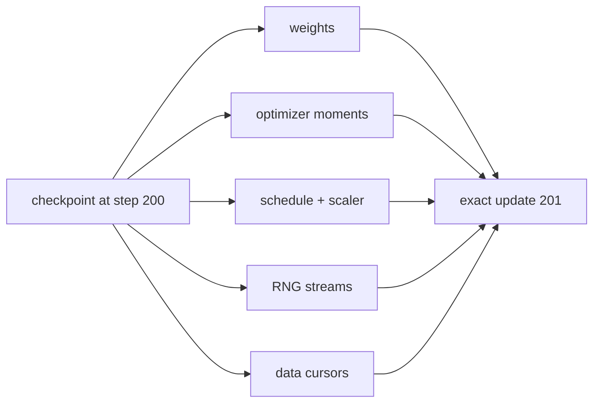

# Diagram — Deterministic Resume — Continue the Same Experiment, Not a Similar One


```mermaid
flowchart LR
  C["checkpoint at step 200"] --> W["weights"]
  C --> O["optimizer moments"]
  C --> S["schedule + scaler"]
  C --> R["RNG streams"]
  C --> D["data cursors"]
  W --> N["exact update 201"]
  O --> N
  S --> N
  R --> N
  D --> N
```

```text
weights alone restore a model; complete state restores an experiment
```
