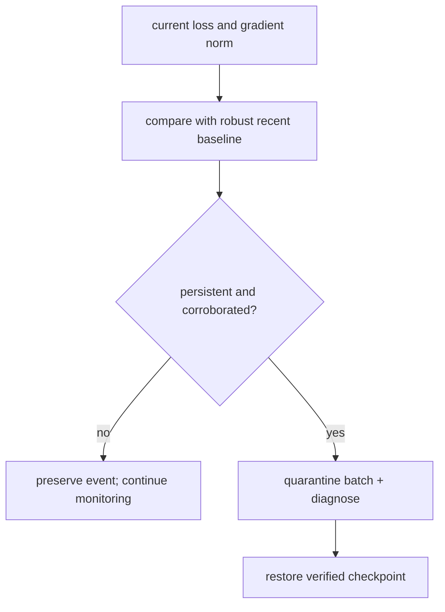

# Diagram — Loss Spikes — Distinguish One Hard Batch from a Run Leaving the Road



```text
one hard batch:  spike -> normal
divergence:      spike -> high -> higher + gradient growth
```

<!-- memory-film-v1:start -->
## Five-frame memory film

```text
QUESTION       What fails if we declare any loss larger than the previous loss a failure and restore immediately?
     ↓
OBJECT         the loss spikes compass mounted on the chain-of-custody ledger
     ↓
VISIBLE BREAK  The compass follows the tempting path—declare any loss larger than the previous loss a failure and restore immediately. Then the evidence answers: ordinary batches vary, so healthy learning triggers constant rollbacks. A slow divergence can rise without one dramatic step and escape the rule.
     ↓
TRANSFORMATION The archivist-engineer changes one moving part. The compass can now compare current loss and gradient norm with robust running baselines, require persistence or corroborating signals, preserve the suspect batch, and recover from a verified clean checkpoint under a documented response.
     ↓
MEMORY SEAL    Loss Spikes keeps the missing power: compare current loss and gradient norm with robust running baselines, require persistence or corroborating signals, preserve the suspect batch, and recover from a verified clean checkpoint under a documented response.
```
<!-- memory-film-v1:end -->
