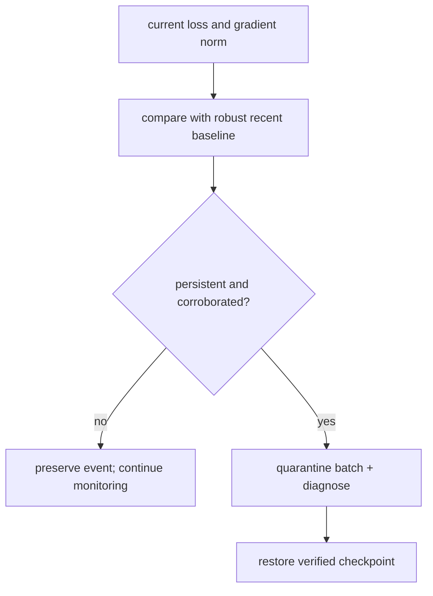

# Diagram — Loss Spikes — Distinguish One Hard Batch from a Run Leaving the Road


```mermaid
flowchart TD
  L["current loss and gradient norm"] --> Z["compare with robust recent baseline"]
  Z --> P{"persistent and corroborated?"}
  P -->|"no"| KEEP["preserve event; continue monitoring"]
  P -->|"yes"| SAVE["quarantine batch + diagnose"] --> R["restore verified checkpoint"]
```

```text
one hard batch:  spike -> normal
divergence:      spike -> high -> higher + gradient growth
```
