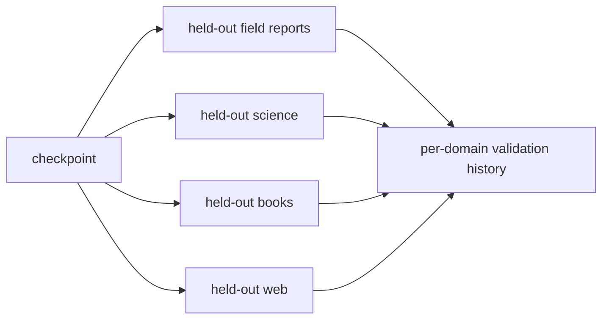

# Diagram — A Validation Stream — Ask Whether Learning Survives Outside the Current Batch



```text
global average down can still hide field-report loss up
```

<!-- memory-film-v1:start -->
## Five-frame memory film

```text
QUESTION       What fails if we evaluate only the next training batch because it is already available?
     ↓
OBJECT         the validation stream bridge mounted on the chain-of-custody ledger
     ↓
VISIBLE BREAK  The bridge follows the tempting path—evaluate only the next training batch because it is already available. Then the evidence answers: the same data mixture and duplicates that shaped the update also judge it. Training loss can fall while held-out language or a rare domain becomes worse.
     ↓
TRANSFORMATION The archivist-engineer changes one moving part. The bridge can now maintain versioned, deduplicated, contamination-checked validation streams by domain and evaluate them at recorded token intervals without using them to update weights.
     ↓
MEMORY SEAL    A Validation Stream keeps the missing power: maintain versioned, deduplicated, contamination-checked validation streams by domain and evaluate them at recorded token intervals without using them to update weights.
```
<!-- memory-film-v1:end -->
