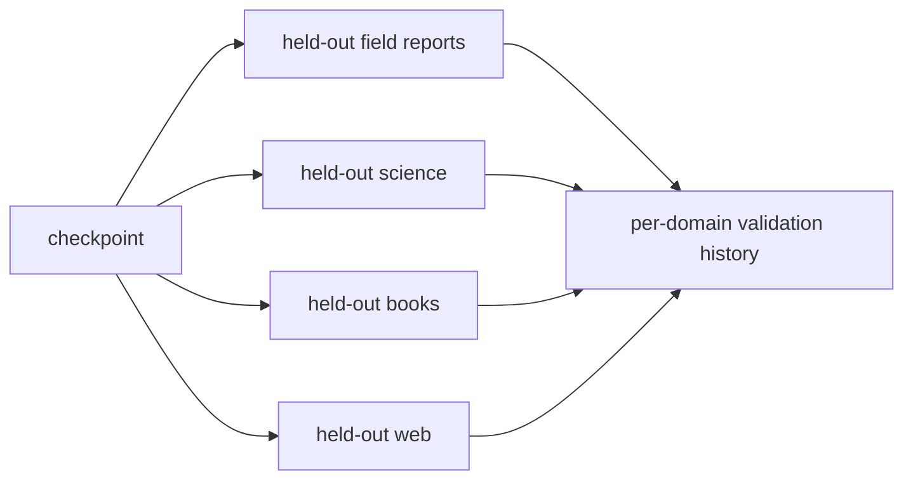

# Diagram — A Validation Stream — Ask Whether Learning Survives Outside the Current Batch


```mermaid
flowchart LR
  C["checkpoint"] --> F["held-out field reports"]
  C --> S["held-out science"]
  C --> B["held-out books"]
  C --> W["held-out web"]
  F --> DASH["per-domain validation history"]
  S --> DASH
  B --> DASH
  W --> DASH
```

```text
global average down can still hide field-report loss up
```
